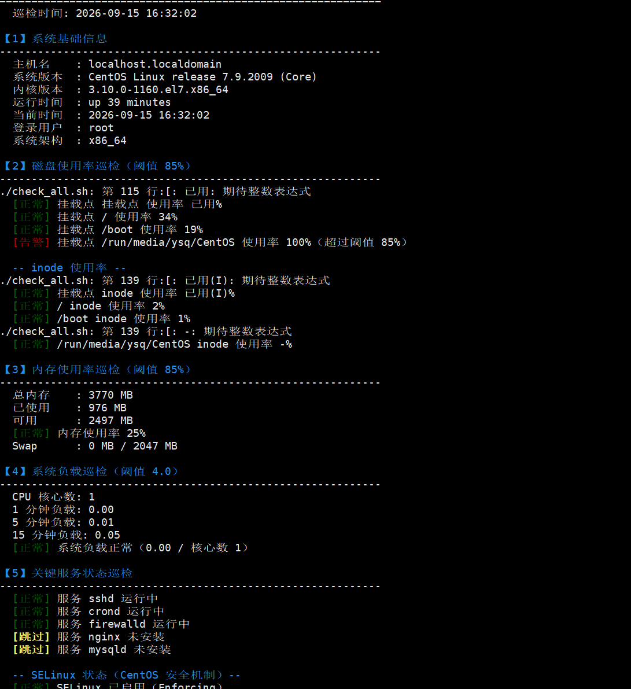

# Linux 自动化巡检脚本集
## 运行效果


一套基于 Shell 的 Linux 服务器日常巡检与运维自动化脚本，用于替代人工巡检。

**适配环境：CentOS 7 / 8、RHEL 7+、Rocky Linux、AlmaLinux**（含发行版判断，Ubuntu 亦可运行）

## 功能概览

| 脚本 | 功能 |
|------|------|
| `check_all.sh` | 一键巡检：共 **9 大项**，覆盖系统、磁盘、内存、负载、服务、端口、日志、进程、安全 |
| `clean_logs.sh` | 按保留天数自动清理历史日志，支持预演模式与白名单保护 |
| `crontab.example` | 定时任务配置示例 |

## 巡检项清单（9 项）

`check_all.sh` 共检查 **9 大项**：

| # | 巡检项 | 内容 | 阈值/说明 |
|---|--------|------|-----------|
| 1 | 系统基础信息 | 主机名、系统版本、内核、运行时长、架构 | — |
| 2 | 磁盘使用率 | 逐挂载点检查 + **inode 使用率** | 磁盘 >85% 告警 |
| 3 | 内存使用率 | 总内存、已用、可用、Swap | >85% 告警 |
| 4 | 系统负载 | 1/5/15 分钟负载 + CPU 核心数对比 | >4.0 告警 |
| 5 | 关键服务状态 | sshd / crond / firewalld / nginx / mysqld | 未运行告警 |
| 5+ | **SELinux 状态** | CentOS 安全机制检查 | 非 Enforcing 提示 |
| 5+ | **防火墙状态** | firewalld 运行状态 + 已开放端口 | 未运行告警 |
| 6 | 关键端口监听 | 22 / 80 / 443 / 3306 / 6379 | 未监听提示 |
| 7 | 日志错误扫描 | `/var/log/messages`、`/var/log/secure` 最近 100 行 | 发现 error/fail/denied 告警 |
| 8 | 资源占用 TOP5 | CPU 占用 TOP5 + 内存占用 TOP5 | — |
| 9 | **登录失败检查** | 统计 `Failed password` 次数 | >10 次告警（疑似暴力破解） |

巡检结束后输出**总结**：正常项、告警项、跳过项数量，以及报告文件路径。

## 快速开始

### 1. 部署脚本

```bash
mkdir -p ~/auto-ops && cd ~/auto-ops
# 将 check_all.sh、clean_logs.sh 放入该目录
chmod +x check_all.sh clean_logs.sh
```

### 2. 执行巡检

```bash
./check_all.sh
```

### 3. 查看巡检报告

```bash
ls -lt /var/log/ops-check/
cat /var/log/ops-check/report_*.txt
```

## 日志清理

```bash
# 预演模式（只显示将删除什么，不实际删除）—— 强烈建议先跑这个
./clean_logs.sh -h

# 实际清理（保留最近 7 天）
./clean_logs.sh

# 自定义：只清理 /var/log/nginx，保留最近 3 天
./clean_logs.sh -d /var/log/nginx -n 3
```

**白名单保护机制：** `messages`、`secure`、`cron`、`maillog`、`wtmp` 等系统关键日志**永不被清理**，避免误删导致无法排查问题。

## 定时任务配置

```bash
crontab -e
```

添加以下内容（详见 `crontab.example`）：

```cron
# 每天 9:00 执行巡检
0 9 * * * /root/auto-ops/check_all.sh >> /var/log/ops-check/cron_check.log 2>&1

# 每周日凌晨 3:00 清理日志（保留 7 天）
0 3 * * 0 /root/auto-ops/clean_logs.sh -n 7 >> /var/log/ops-check/cron_clean.log 2>&1
```

**CentOS 查看 cron 执行日志：**

```bash
grep CRON /var/log/cron
```

## 配置说明

脚本顶部的「配置区」可修改：

```bash
# check_all.sh
DISK_THRESHOLD=85              # 磁盘告警阈值（%）
MEM_THRESHOLD=85               # 内存告警阈值（%）
LOAD_THRESHOLD=4.0             # 负载告警阈值
SERVICES=("sshd" "crond" ...)  # 要监控的服务（CentOS 服务名）
LOG_FILES=(...)                # 要扫描的日志文件

# clean_logs.sh
KEEP_DAYS=7                    # 日志保留天数
LOG_DIRS=("/var/log" ...)      # 要清理的目录
PROTECTED=(...)                # 永不清理的日志白名单
```

## 输出示例

```
============================================================
         Linux 系统自动化巡检报告
============================================================
  巡检时间: 2026-09-14 19:30:12

【1】系统基础信息
------------------------------------------------------------
  主机名    : centos-test
  系统版本  : CentOS Linux release 7.9.2009 (Core)
  内核版本  : 3.10.0-1160.el7.x86_64
  运行时间  : up 3 days, 2 hours
  系统架构  : x86_64

【2】磁盘使用率巡检（阈值 85%）
------------------------------------------------------------
  [正常] 挂载点 / 使用率 42%
  [正常] 挂载点 /boot 使用率 18%

  -- inode 使用率 --
  [正常] / inode 使用率 5%

【5】关键服务状态巡检
------------------------------------------------------------
  [正常] 服务 sshd 运行中
  [正常] 服务 crond 运行中
  [告警] 服务 firewalld 未运行
  [跳过] 服务 nginx 未安装

  -- SELinux 状态（CentOS 安全机制）--
  [正常] SELinux 已启用（Enforcing）

【9】登录失败记录检查（最近 20 条）
------------------------------------------------------------
  [正常] 登录失败次数正常（2 次）

【巡检总结】
------------------------------------------------------------
  正常项 : 14
  告警项 : 1
  跳过项 : 3
  报告文件: /var/log/ops-check/report_20260914_193012.txt

  >>> 发现 1 项异常，请及时处理 <<<
============================================================
```

## 技术要点

- **纯 Shell 实现**，无第三方依赖，适配 CentOS / RHEL / Ubuntu
- **发行版自适应**：自动识别 `/etc/redhat-release` 与 `/etc/os-release`
- **服务名适配**：CentOS 环境使用 `mysqld`、`firewalld`、`crond`
- **日志路径适配**：CentOS 使用 `/var/log/messages`、`/var/log/secure`
- **阈值可配置**：不同环境无需改代码
- **双通道输出**：屏幕显示（带颜色）+ 写入报告文件，便于留档
- **安全设计**：日志清理支持 `-h` 预演模式 + 关键日志白名单保护
- **兼容处理**：`netstat` / `ss` 双命令自动选择；服务未安装自动跳过
- **inode 检查**：除了磁盘空间，还检查 inode，避免"空间够但无法创建文件"
- **安全巡检**：包含 SELinux、firewalld、登录失败次数检查

## 环境要求

- Linux（CentOS 7+ / RHEL 7+ / Ubuntu 18.04+）
- Bash 4.0+
- `net-tools`（CentOS 7 自带 netstat；CentOS 8 可用 `yum install net-tools`）
- 部分检查需要 `sudo` 权限

## 目录结构

```
auto-ops/
├── check_all.sh          # 巡检主脚本（9 大项）
├── clean_logs.sh         # 日志清理脚本（含白名单保护）
├── crontab.example       # 定时任务配置示例
└── README.md             # 说明文档
```
